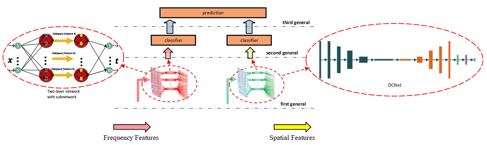

# DCNet-EEG

## Overview
This repository contains the implementation of the DCNet-EEG, as detailed in our published paper: 
[Minimizing EEG Human Interference: A Study of an Adaptive EEG Spatial Feature Extraction with Deep Convolutional Neural Networks](https://ieeexplore.ieee.org/abstract/document/10505033). 
The code utilizes deep convolutional neural networks to extract spatial features from EEG data effectively.

## Dataset
The processed SEED dataset converted to NumPy format can be accessed through the following link:
- [Processed SEED Dataset](https://drive.google.com/drive/folders/1Z07TRemWf507E16aTShFsbExy3JdI6aS?usp=sharing)

Additionally, the extracted frequency features are available here:
- [Extracted Frequency Features](https://drive.google.com/drive/folders/1Mv0uqeDMcWPXgEtMoaPm_89JF4qsN5g9?usp=sharing)

## Installation
Before running the code, please set up the environment according to the `requirements.txt` file to ensure all dependencies are properly installed.

## Usage
After downloading the datasets and adding them to the root directory, you can run the `SEED_DEMO.ipynb` notebook to reproduce the results presented in the paper.
